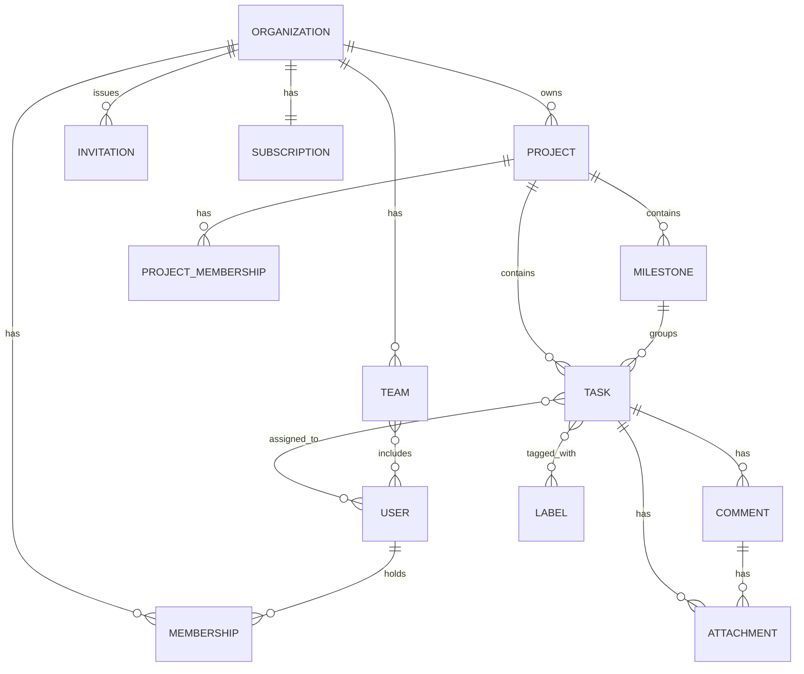

# 04 — Domain Model & Relationships

**Phase:** 2 · **Status:** Draft v1 · **Depends on:** 03-business-domains-and-modules.md

---

## 4.1 Full Entity Tree

```
Organization
│
├── Membership (User ↔ Org, role)
│      └── User
│
├── Teams
│      └── TeamMember (User ↔ Team)
│
├── Invitations
│
├── Projects
│      │
│      ├── ProjectMembership (User ↔ Project, role)
│      │
│      ├── Tasks
│      │      │
│      │      ├── Comments
│      │      │      └── Attachments
│      │      ├── Attachments
│      │      ├── Labels (many-to-many)
│      │      └── TaskAssignees (many-to-many, User)
│      │
│      ├── Milestones
│      │      └── Tasks (one-to-many, optional FK)
│      │
│      └── Labels (project-scoped taxonomy)
│
├── Subscription
│      └── BillingEvents (payment history)
│
└── AuditLog (append-only, references any entity via polymorphic target)

Notification (references User + polymorphic source entity)
ActivityEntry (references Organization + polymorphic source entity)
SearchIndexEntry (derived, references Organization + polymorphic source entity)
```

## 4.2 Cardinalities

| Relationship | Cardinality | Notes |
|---|---|---|
| Organization → Membership | 1 : N | One org, many members |
| User → Membership | 1 : N | A user can belong to multiple orgs |
| Organization → Project | 1 : N | Projects never cross orgs |
| Project → Task | 1 : N | Tasks never cross projects |
| Task → Comment | 1 : N | |
| Task ↔ Label | N : N | via `task_labels` join table |
| Task ↔ User (assignee) | N : N | via `task_assignees` join table (supports multi-assignee) |
| Task → Attachment | 1 : N | |
| Comment → Attachment | 1 : N | Optional, attachments can hang off either |
| Project → Milestone | 1 : N | |
| Milestone → Task | 1 : N | Optional FK on Task (`milestoneId` nullable) |
| Organization → Team | 1 : N | |
| Team ↔ User | N : N | via `team_members` |
| Organization → Subscription | 1 : 1 | One active subscription per org |
| Organization → Invitation | 1 : N | |
| * → AuditLog | 1 : N (polymorphic) | Every entity can generate log rows |

## 4.3 Ownership & Cascade Rules (summary — full detail per-entity in 05)

| Parent deleted | Effect on children |
|---|---|
| Organization | **Blocked** if active Subscription or any non-archived Project exists (see business rules) |
| Project | Soft-delete cascades to Tasks (soft-delete, not hard-delete) |
| Task | Hard-delete cascades to Comments/Attachments only after a 30-day trash window |
| User | Cannot hard-delete if they own an Organization; membership rows are soft-deleted, historical Task/Comment authorship is preserved (`authorId` kept, display falls back to "Deactivated User") |
| Milestone | Deleting a milestone nulls `milestoneId` on its tasks, does not delete tasks |

## 4.4 Polymorphic References (AuditLog, Notification, Activity, Search)

These four entities all reference "some other entity" without a rigid FK,
using a `(targetType, targetId)` pair:

```
targetType ∈ {
  ORGANIZATION, PROJECT, TASK, COMMENT, MEMBERSHIP,
  INVITATION, SUBSCRIPTION, TEAM, MILESTONE, ATTACHMENT
}
```

This is a deliberate trade-off: we lose DB-level referential integrity on
these four tables in exchange for not needing a join table per entity
type per cross-cutting concern. Enforcement of validity is application-level
(see `07-database-design.md` §Polymorphic Reference Strategy for the
alternative considered and rejected: per-type FK columns).

## 4.5 Aggregate Roots (for API/transaction boundaries)

| Aggregate Root | Includes | Why |
|---|---|---|
| Organization | Membership, Teams, Invitations, Subscription | Tenant-boundary transactions (e.g., deleting an org) must be atomic across these |
| Project | ProjectMembership, Milestones, Labels (project-scoped) | Project deletion/archival is a single transactional unit |
| Task | Comments, Attachments, TaskAssignees, TaskLabels | A task and its direct children are edited/deleted together |
| User | — (Users are their own root, referenced by others, not owned by them) | |

Aggregate roots are the transaction boundary used in `08-api-contracts.md` —
a single API call never spans a write across two aggregate roots without
either eventual consistency (via events, see `09-event-flows.md`) or an
explicit documented exception.

## 4.6 Relationship Diagram (Mermaid — renders on GitHub)



---
*Changelog*
- v1.0 — Full entity tree, cardinalities, cascade rules, aggregate roots defined.
